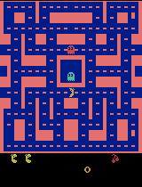

# Training a Ms. Pac-Man Agent (Deep Q-Network)

## Overview & Instructions
This repository contains a Deep Q-Network (DQN) agent trained to play Ms. Pac-Man. The agent learns entirely through trial and error by observing the game pixels and receiving in-game score rewards. The notebook is based on [pepealonso95/pacman-dqn](https://github.com/pepealonso95/pacman-dqn).

**How to open and run the notebook:**
1. Open [`Amelia_Roeschel_pacman_dqn.ipynb`](Amelia_Roeschel_pacman_dqn.ipynb) in Google Colab, Jupyter, or VS Code (Python 3.11–3.13 kernel).
2. If using Colab, select a GPU runtime (**Runtime → Change runtime type → T4 GPU**).
3. The hyperparameters are pre-set in Section 1. Select **Run All** to execute the notebook from top to bottom. Setup, baseline evaluation, training, final evaluation, and the results ZIP download run automatically.

The notebook is saved with all outputs from the submitted run, so the scores, plots, and gameplay can be inspected without rerunning it. Only the three settings in Section 1 were changed across my experiments; every other setting is the notebook default, recorded in [config.json](results/config.json).

---

## ⚙️ Hyperparameters
* **Exploration Rate:** `0.09` - I lowered exploration across my runs, from 0.25 to 0.10 and finally to 0.09. In Ms. Pac-Man a random turn often walks straight into a ghost, so a high random rate ends games early and the agent rarely sees the later part of a maze. The agent is also evaluated at 5% exploration, so training nearer that value practices the behavior being graded. I kept it above 5% so the agent still had some pressure to try alternatives, since exploration is fixed for the whole run rather than decaying.
* **Episodes:** `1000` - My previous run's training scores were still trending upward when it ended at 250 episodes, which suggested the agent had not finished learning. Quadrupling the budget produced 148,477 learning updates instead of 37,419, and still finished in under 40 minutes on a Colab T4.
* **Learning Rate:** `0.0001` - An earlier run at 0.0002 showed loss climbing while training scores fell, which suggested each update was too large for a replay memory holding only 5,000 decisions. At 0.0001 learning became steadier, so I held it fixed for my last two runs.

Note that this run changed **two** settings from my previous one (exploration 0.10 → 0.09 and episodes 250 → 1000), so the improvement below cannot be attributed to the episode budget alone.

---

## 🧠 How the Agent Works
* **Observations:** The agent "sees" the game as a stack of **four consecutive 84×84 grayscale game screens**. Stacking four frames lets the network perceive movement and direction (like which way the ghosts are moving).
* **Actions:** The agent chooses one of **9 joystick moves**: NOOP (no move), UP, RIGHT, LEFT, DOWN, UPRIGHT, UPLEFT, DOWNRIGHT, DOWNLEFT. Each decision is held for four game frames.
* **Rewards:** The reward is the **game points** it earns (eating dots, fruit, or vulnerable ghosts). During learning each reward is clipped to between −1 and +1, so a 10-point dot and a 200-point ghost look equally good to the network; every score reported below is the real game score.

---

## 📊 Evaluation & Scores

### Score Comparison
Evaluation used the notebook's fixed settings before and after training: the same five seeds, 5% exploration, and a 3,000-decision time limit. The baseline is the untrained network, not a random-action agent. Full data: [comparison.json](results/comparison.json).

| Evaluation Game | Baseline (Untrained) Score | Trained Score |
| :--- | :--- | :--- |
| **Seed 101** | 350 | 970 |
| **Seed 202** | 500 | 560 |
| **Seed 303** | 320 | 810 |
| **Seed 404** | 800 | 2150 |
| **Seed 505** | 490 | 870 |
| **MEAN SCORE** | **492.0** | **1072.0** |

**Change in mean score: +580.0 (+118%).** All five games improved, which none of my earlier runs achieved. No game hit the time limit, before or after: every game ended at game over.

One caveat on the mean: seed 404's 2,150 is a single unusually good game that lifts the average. Excluding it, the remaining four games still average 802.5 against a 490 baseline for the same seeds, so the improvement does not depend on that one result.

**Expectations vs. Observations:**
I expected that less randomness would lead to better results, because more of the agent's moves would be based on the logic it had learned instead of chance. I also expected more iterations to lead to higher scores, since the agent keeps getting trained over time.

Both expectations held, but not evenly. The trained mean roughly doubled the baseline, and the agent scores noticeably faster: in the best game it collects 500 points within the first 20 seconds, against 230 in my 250-episode run and 210 in my 100-episode run. Survival time barely moved, about 683 decisions per evaluation game versus 696 before, so the gain came from scoring more efficiently in the time it had, not from living longer.

The second expectation held only for the first half of training. The 25-game average climbed from roughly 480 to a 750–900 band by about episode 400, then oscillated inside that band for the remaining 600 games without a clear upward trend. More games kept helping until they didn't.

**Loss behaved differently this time.** Mean update loss rose to about 0.12 by episode 200 and then flattened, instead of climbing throughout as it did in my 250-episode run. Rising loss is not automatically bad here: it measures the gap between predicted and target values, and that gap grows as the agent starts finding bigger rewards. A loss curve that levels off while scores hold up is what a settling agent looks like.

### Experiment Log
All four runs used identical evaluation settings, so their trained means are directly comparable. The baseline is the same every time because the starting weights come from a fixed seed.

| Run | Exploration | Episodes | Learning rate | Learning updates | Baseline mean | Trained mean |
| :--- | :--- | :--- | :--- | :--- | :--- | :--- |
| 1 (setup check) | 0.25 | 5 | 0.0002 | 539 | 492.0 | 730.0 |
| 2 | 0.25 | 100 | 0.0002 | 14,706 | 492.0 | 534.0 |
| 3 | 0.10 | 250 | 0.0001 | 37,419 | 492.0 | 664.0 |
| **4 (submitted)** | **0.09** | **1000** | **0.0001** | **148,477** | **492.0** | **1072.0** |

Run 1 was a five-episode setup check with only 539 learning updates, so its 730 reflects luck across five games rather than learning — a useful reminder of how noisy a five-game evaluation is. Run 2 trained 20× longer and scored worse, which is what prompted lowering both exploration and the learning rate. Runs 3 and 4 then improved steadily.

---

## 📈 Training Statistics & Hardware
* **Run status:** Completed (not interrupted). Run ID `20260915_231634_675837`.
* **Hardware Used:** NVIDIA T4 GPU (CUDA) via Google Colab. Exact Python and package versions are recorded in [config.json](results/config.json).
* **Completed Episodes:** 1,000 of 1,000
* **Total Decisions (Steps):** 594,907
* **Total Learning Updates:** 148,477
* **Elapsed Training Time:** 2,265 seconds (37.8 minutes, including the periodic gameplay samples)
* **Best single training game:** 4,020 points

Source: [training_summary.json](results/training_summary.json)

---

## 🔬 Limitations & Next Steps
* **Observed Limitation:** Learning plateaued. After roughly episode 400 the 25-game average stopped trending upward, even though training continued for 600 more games, and the agent stayed inconsistent: its progress samples swing between 250 and 1,930 points on the same seed, and seed 202 scored 560 here against 850 in my shorter run. The likely cause is memory rather than practice. The agent remembers only its last 5,000 decisions, about eight games, so late in training it is still learning from a narrow slice of recent experience and cannot revisit the rare good games that would teach it the most. Watching the clips, it clears dots efficiently near where it starts but shows no sign of a plan for finishing a maze or for using power pellets to hunt ghosts.
* **Next Experiment:** I would change only the **replay memory size**, from `5,000` to `50,000` decisions, keeping exploration at 0.09, episodes at 1,000, and the learning rate at 0.0001. The assignment allows tuning settings beyond the three main dials as long as the change is explained, and the plateau above points at memory as the binding constraint rather than the amount of play. A ten-times-larger memory would let the agent keep learning from roughly 80 past games instead of 8. I would expect the 25-game average to keep climbing past episode 400 instead of flattening, and I would watch whether the evaluation scores become less erratic across the five seeds.

---

## 📁 Visual Evidence & Artifacts
GIFs show the first 20 seconds of a game at 4× speed.

### Untrained Baseline Gameplay
First evaluation game (seed 101), before any training:

### Best Trained Gameplay
Highest-scoring of the five final evaluation games (seed 404, 2,150 points):

### Intermediate Gameplay
This run saved a sample every 25 episodes, 40 in total. All of them are in the [results folder](results); shown below is every 100th episode. Each plays seed 101 with the network as it stood at that episode. These are single games, so their scores are noisy — the evaluation table above is the evidence.

| After 100 (720) | After 200 (600) | After 300 (430) | After 400 (410) | After 500 (500) |
| :---: | :---: | :---: | :---: | :---: |
|  |  |  |  |  |
| **After 600 (1350)** | **After 700 (920)** | **After 800 (520)** | **After 900 (720)** | **After 1000 (970)** |
|  |  |  |  |  |

### Training Dashboard
Raw score per game with a 25-game average, mean update loss, and exploration:

### Raw Data Links
* [Executed Notebook (Amelia_Roeschel_pacman_dqn.ipynb)](Amelia_Roeschel_pacman_dqn.ipynb)
* [comparison.json](results/comparison.json)
* [config.json](results/config.json)
* [training.csv](results/training.csv)
* [training_summary.json](results/training_summary.json)

### Model Checkpoints
Model checkpoints (`untrained.pt`, 40 periodic checkpoints, and `trained.pt`, about 6 MB each) are kept out of this repository to keep it small. They are saved in the full results ZIP for run `20260915_231634_675837`, which I keep locally.
