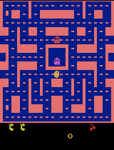
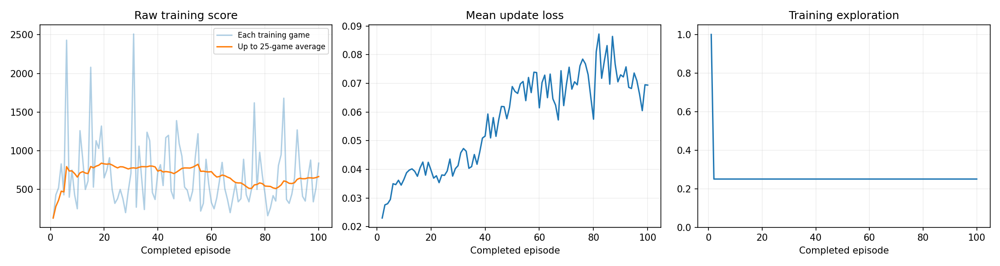

# Training a Ms. Pac-Man Agent (Deep Q-Network)

## Overview & Instructions
This repository contains a Deep Q-Network (DQN) agent trained to play Ms. Pac-Man. The agent learns entirely through trial and error by observing the game pixels and receiving in-game score rewards.

**How to open and run the notebook:**
1. Open `pacman_dqn.ipynb` in Google Colab, Jupyter, or VS Code.
2. If using Colab, ensure you select a GPU runtime (**Runtime → Change runtime type → T4 GPU**).
3. The hyperparameters are pre-set in Section 1. Select **Run All** to execute the notebook from top to bottom. Setup, training, and evaluation will run automatically.

---

## ⚙️ Hyperparameters
I used the following settings for this experiment:
* **Exploration Rate:** `0.25` - I chose 25% to allow the agent to rely on its learned policy most of the time while still leaving enough room (1/4 of its moves) to discover new, potentially better paths.
* **Episodes:** `5` - I chose a 5-episode budget as an initial test run to verify that the training pipeline, hardware setup, and evaluation processes work correctly before committing to a massive training budget.
* **Learning Rate:** `0.0002` - I used a small learning rate to ensure the network updates its weights gradually, preventing it from wildly forgetting past lessons.

---

## 🧠 How the Agent Works
* **Observations:** The agent "sees" the game environment as a stack of **four consecutive 84x84 grayscale game screens**. Stacking four frames allows the network to perceive movement and direction (like the ghosts moving).
* **Actions:** The agent can choose from standard joystick directions (e.g., UP, DOWN, LEFT, RIGHT, UPRIGHT).
* **Rewards:** The agent's reward is supplied directly by the **game points** it earns (e.g., eating dots, fruit, or vulnerable ghosts). 

---

## 📊 Evaluation & Scores

**Expectations vs. Observations:**
Before training, I expected the agent to perform very poorly, likely running straight into ghosts or getting stuck in corners. After a short 5-episode training run, I observed that it [Insert a brief sentence about what you actually saw, e.g., "started to follow paths with more dots, though it still struggled to avoid ghosts consistently due to the low episode budget"].

### Score Comparison
| Evaluation Game | Baseline (Untrained) Score | Trained Score |
| :--- | :--- | :--- |
| **Seed 101** | `[Insert Score]` | `[Insert Score]` |
| **Seed 202** | `[Insert Score]` | `[Insert Score]` |
| **Seed 303** | `[Insert Score]` | `[Insert Score]` |
| **Seed 404** | `[Insert Score]` | `[Insert Score]` |
| **Seed 505** | `[Insert Score]` | `[Insert Score]` |
| **MEAN SCORE** | **`[Insert Baseline Mean]`** | **`[Insert Trained Mean]`** |

---

## 📈 Training Statistics & Hardware
* **Hardware Used:** T4 GPU (via Google Colab)
* **Completed Episodes:** `5`
* **Total Decisions (Steps):** `[Insert from training_summary.json]`
* **Total Learning Updates:** `[Insert from training_summary.json]`
* **Elapsed Training Time:** `[Insert from training_summary.json]`

---

## 🔬 Limitations & Next Steps
* **Observed Limitation:** [Insert one limitation, e.g., "The agent occasionally traps itself in corners because it cannot plan far enough ahead to see approaching ghosts from multiple directions."]
* **Next Experiment:** For the next experiment, I would change the **Episodes** setting from `5` to `100` (or higher). A 5-episode budget is not nearly enough gameplay experience for the neural network to converge on a highly successful strategy. Increasing the training budget would give it the necessary time to refine its Q-values and achieve a significantly higher mean score.

---

## 📁 Visual Evidence & Artifacts

### Untrained Baseline Gameplay

### Best Trained Gameplay

*(Note: Since this run was under 25 episodes, no intermediate checkpoints were generated).*

### Training Dashboard

### Raw Data Links
* [Executed Notebook (pacman_dqn.ipynb)](pacman_dqn.ipynb)
* [comparison.json](results/comparison.json)
* [config.json](results/config.json)
* [training.csv](results/training.csv)
* [training_summary.json](results/training_summary.json)
