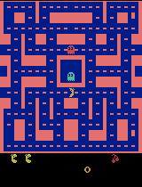

# Training a Ms. Pac-Man Agent (Deep Q-Network)

## Overview & Instructions
This repository contains a Deep Q-Network (DQN) agent trained to play Ms. Pac-Man. The agent learns entirely through trial and error by observing the game pixels and receiving in-game score rewards. The notebook is based on [pepealonso95/pacman-dqn](https://github.com/pepealonso95/pacman-dqn).

**How to open and run the notebook:**
1. Open [`Amelia_Roeschel_pacman_dqn.ipynb`](Amelia_Roeschel_pacman_dqn.ipynb) in Google Colab, Jupyter, or VS Code (Python 3.11–3.13 kernel).
2. If using Colab, select a GPU runtime (**Runtime → Change runtime type → T4 GPU**).
3. The hyperparameters are pre-set in Section 1. Select **Run All** to execute the notebook from top to bottom. Setup, baseline evaluation, training, final evaluation, and the results ZIP download run automatically.

The notebook is saved with all outputs from the submitted run, so the scores, plots, and gameplay can be inspected without rerunning it. Only the three settings in Section 1 were changed; every other setting is the notebook default, recorded in [config.json](results/config.json).

---

## ⚙️ Hyperparameters
* **Exploration Rate:** `0.10` - My earlier run used 25%, which meant one move in four was a coin flip. In Ms. Pac-Man a random turn frequently walks straight into a ghost, so games ended early and the agent rarely saw the later part of a maze. Exploration is also fixed at 5% during evaluation, so training nearer that value practices the behavior being graded. 0.10 is the value the original DQN paper settled on.
* **Episodes:** `250` - 2.5× my previous budget, chosen to give the network meaningfully more experience (37,419 learning updates instead of 14,706) while still finishing inside one Colab session. Training took under 10 minutes.
* **Learning Rate:** `0.0001` - My earlier run used 0.0002 and its loss climbed while training scores fell, which suggested each update was too large for a replay memory holding only 5,000 decisions. I halved it to the notebook's reference value to make learning steadier.

---

## 🧠 How the Agent Works
* **Observations:** The agent "sees" the game as a stack of **four consecutive 84×84 grayscale game screens**. Stacking four frames lets the network perceive movement and direction (like which way the ghosts are moving).
* **Actions:** The agent chooses one of **9 joystick moves**: NOOP (no move), UP, RIGHT, LEFT, DOWN, UPRIGHT, UPLEFT, DOWNRIGHT, DOWNLEFT. Each decision is held for four game frames.
* **Rewards:** The reward is the **game points** it earns (eating dots, fruit, or vulnerable ghosts). During learning each reward is clipped to between −1 and +1, so a 10-point dot and a 200-point ghost look equally good to the network; every score reported below is the real game score.

---

## 📊 Evaluation & Scores

### Score Comparison
Evaluation used the notebook's fixed settings before and after training: the same five seeds, 5% exploration, and a 3,000-decision time limit. The baseline is the untrained network, not a random-action agent. Full data: [comparison.json](results/comparison.json).

| Evaluation Game | Baseline (Untrained) Score | Trained Score |
| :--- | :--- | :--- |
| **Seed 101** | 350 | 640 |
| **Seed 202** | 500 | 850 |
| **Seed 303** | 320 | 580 |
| **Seed 404** | 800 | 590 |
| **Seed 505** | 490 | 660 |
| **MEAN SCORE** | **492.0** | **664.0** |

**Change in mean score: +172.0 (+35%).** Four of the five games improved; seed 404 fell from 800 to 590. No game hit the time limit, before or after: every game ended at game over.

**Expectations vs. Observations:**
I expected that less randomness would lead to better results, because more of the agent's moves would be based on the logic it had learned instead of chance. I also expected more iterations to lead to higher scores, since the agent keeps getting trained over time.

What I observed was a larger improvement than expected, and more consistent play. The trained scores fall in a 580–850 band, while my previous run ranged from 150 to 920 — its high average depended on one good game. The agent also survives longer: about 696 decisions per game versus 564 before, roughly 23% more game time. Seed 202 is the clearest example, going from 345 decisions and 150 points in the previous run to 825 decisions and 850 points here.

The training dashboard shows the 25-game average rising from about 480 to a peak near 890 around episode 205, ending near 725. The best single training game scored 2,130.

**Loss rose while play improved.** Mean update loss climbed from about 0.02 to 0.14. That is not a failure: loss measures the gap between predicted and target values, and as the agent finds larger rewards, its value estimates grow and the gap grows with them. Judging this run by loss alone would have been misleading in the opposite direction from the usual warning.

In the gameplay, the trained agent keeps collecting points across the whole 20-second clip rather than stalling after its first burst, which is what my previous run did. Its opening moves still look much like the untrained agent's; the differences show up later in a game.

### Experiment Log
All three runs used the same evaluation settings, so their trained means are directly comparable.

| Run | Exploration | Episodes | Learning rate | Baseline mean | Trained mean |
| :--- | :--- | :--- | :--- | :--- | :--- |
| 1 (setup check) | 0.25 | 5 | 0.0002 | 492.0 | 730.0 |
| 2 | 0.25 | 100 | 0.0002 | 492.0 | 534.0 |
| **3 (submitted)** | **0.10** | **250** | **0.0001** | **492.0** | **664.0** |

The baseline is identical every time because the starting weights come from a fixed seed. Run 1 was a 5-episode setup check with only 539 learning updates, so its 730 reflects luck in five games rather than learning — a useful reminder of how noisy a five-game evaluation is. Run 2 trained longer but got worse, which is what prompted the changes above.

---

## 📈 Training Statistics & Hardware
* **Run status:** Completed (not interrupted). Run ID `20260915_230142_498415`.
* **Hardware Used:** NVIDIA T4 GPU (CUDA) via Google Colab. Exact Python and package versions are recorded in [config.json](results/config.json).
* **Completed Episodes:** 250 of 250
* **Total Decisions (Steps):** 150,674
* **Total Learning Updates:** 37,419
* **Elapsed Training Time:** 568 seconds (about 9.5 minutes, including the periodic gameplay samples)

Source: [training_summary.json](results/training_summary.json)

---

## 🔬 Limitations & Next Steps
* **Observed Limitation:** The agent's improvement is real but shallow, and it is still inconsistent from game to game. Seed 404 got worse, not better, and the progress samples swing wildly between single games (160 at episode 175, then 1,420 at episode 200). A likely cause is memory: the agent remembers only its last 5,000 decisions, roughly 8 games, so it keeps learning from a small slice of recent experience rather than everything it has seen. Watching the clips, it collects the dots near where it starts but has no apparent strategy for clearing a maze or for using power pellets to chase ghosts.
* **Next Experiment:** I would change only the **Episodes** setting, from `250` to `1000`, keeping exploration at 0.10 and the learning rate at 0.0001. The 25-game average was still trending upward when this run ended, which suggests the agent had not finished learning. Keeping the other two settings fixed means any change in the trained mean can be attributed to the longer budget alone. If more games alone stop helping, the next lever would be the replay memory rather than the three dials.

---

## 📁 Visual Evidence & Artifacts
GIFs show the first 20 seconds of a game at 4× speed.

### Untrained Baseline Gameplay
First evaluation game (seed 101), before any training:

### Best Trained Gameplay
Highest-scoring of the five final evaluation games (seed 202, 850 points):

### Intermediate Gameplay (every 25 episodes)
Each sample plays seed 101 with the network as it stood at that episode. These are single games, so their scores are noisy; the evaluation table above is the evidence.

| After 25 (440) | After 50 (930) | After 75 (440) | After 100 (480) | After 125 (700) |
| :---: | :---: | :---: | :---: | :---: |
|  |  |  |  |  |
| **After 150 (390)** | **After 175 (160)** | **After 200 (1420)** | **After 225 (420)** | **After 250 (640)** |
|  |  |  |  |  |

### Training Dashboard
Raw score per game with a 25-game average, mean update loss, and exploration:

### Raw Data Links
* [Executed Notebook (Amelia_Roeschel_pacman_dqn.ipynb)](Amelia_Roeschel_pacman_dqn.ipynb)
* [comparison.json](results/comparison.json)
* [config.json](results/config.json)
* [training.csv](results/training.csv)
* [training_summary.json](results/training_summary.json)

### Model Checkpoints
Model checkpoints (`untrained.pt`, `episode_0025.pt` through `episode_0250.pt`, and `trained.pt`, about 6 MB each) are kept out of this repository to keep it small. They are saved in the full results ZIP for run `20260915_230142_498415`, which I keep locally.
